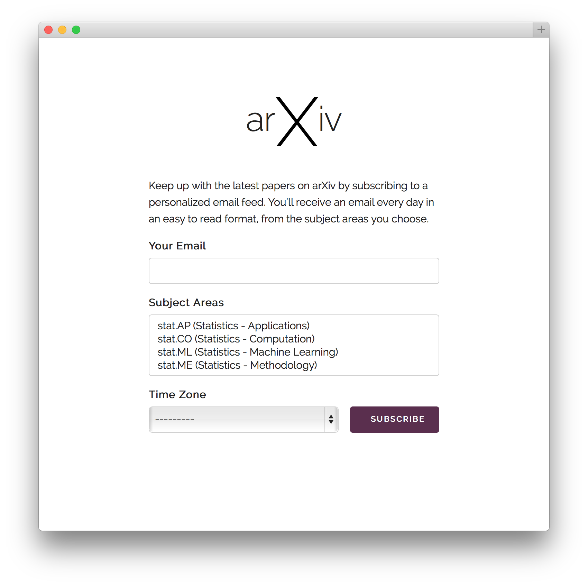
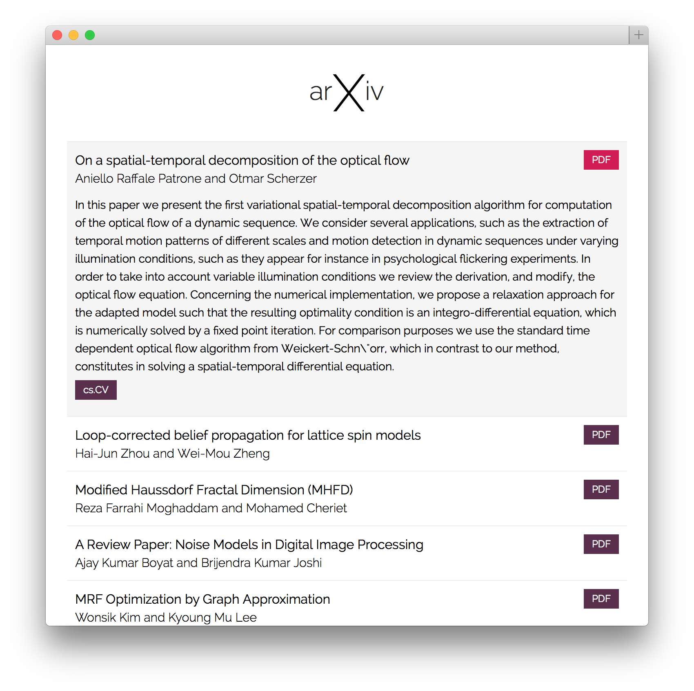

Django arXiv
============
A Django app providing a custom arXiv email feed to subscribers

<table style="border: none !important;">
    <thead><tr>
        <th align="center">Subscribe View</th>
        <th align="center">Web View of Email Feed</th>
    </tr></thead>
    <tbody><tr>
        <td align="center"></td>
        <td align="center"></td>
    </tr></tbody>
</table>
